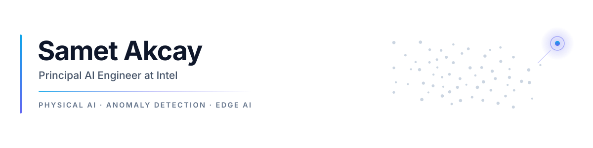

<picture>
  <source media="(prefers-color-scheme: dark)" srcset="./assets/banner-dark.svg">
  <source media="(prefers-color-scheme: light)" srcset="./assets/banner-light.svg">
  
</picture>

I work on physical AI at Intel, mostly training robot policies from human demonstrations and making them run on edge hardware. Before that I spent several years on visual anomaly detection, starting with my PhD at Durham University and later building Anomalib.

[LinkedIn](https://www.linkedin.com/in/sametakcay) · [Google Scholar](https://scholar.google.com/citations?user=SVpL2VMAAAAJ) · [ORCID](https://orcid.org/0000-0003-3334-7118)

### Current work

- [Physical AI Studio](https://github.com/open-edge-platform/physical-ai-studio): an imitation learning framework for robots. You record demonstrations, train a policy (ACT, SmolVLA, Pi0.5, XR0, MolmoACT2, RLDX-1 and anything in LeRobot) and export it to OpenVINO, ONNX or ExecuTorch.
- [physicalai](https://github.com/openvinotoolkit/physicalai): the runtime for deploying those policies. It handles cameras, robot interfaces, inference and the control loop, and currently supports SO-101, Trossen WidowX-AI, Seeed Studio B601 and many other arms.

I gave a talk on this stack at PyTorch Conference Europe 2026: *Full-Stack PyTorch Robotics VLA, from Data to Edge via ExecuTorch/OpenVINO*.

### Earlier projects

- [Anomalib](https://github.com/open-edge-platform/anomalib): a deep learning library for visual anomaly detection, which I created and maintained at Intel.
- [Geti](https://github.com/open-edge-platform/geti): Intel's platform for training computer vision models with less data.
- [GANomaly](https://github.com/samet-akcay/ganomaly) and [Skip-GANomaly](https://github.com/samet-akcay/skip-ganomaly): code for my papers. The models are now part of Anomalib.

### Selected papers

- [FEVER-OOD: Free Energy Vulnerability Elimination for Robust Out-of-Distribution Detection](https://arxiv.org/abs/2412.01596). ICCV 2025.
- [Beyond Academic Benchmarks: Critical Analysis and Best Practices for Visual Industrial Anomaly Detection](https://arxiv.org/abs/2503.23451). CVPR Workshops 2025.
- [Divide and Conquer: High-Resolution Industrial Anomaly Detection via Memory Efficient Tiled Ensemble](https://arxiv.org/abs/2403.04932). CVPR Workshops 2024.
- [Anomalib: A Deep Learning Library for Anomaly Detection](https://arxiv.org/abs/2202.08341). ICIP 2022.
- [Towards Automatic Threat Detection: A Survey of Advances of Deep Learning within X-ray Security Imaging](https://arxiv.org/abs/2001.01293). Pattern Recognition 2022.
- [Skip-GANomaly: Skip Connected and Adversarially Trained Encoder-Decoder Anomaly Detection](https://arxiv.org/abs/1901.08954). IJCNN 2019.
- [GANomaly: Semi-Supervised Anomaly Detection via Adversarial Training](https://arxiv.org/abs/1805.06725). ACCV 2018.

The full list is on [Google Scholar](https://scholar.google.com/citations?user=SVpL2VMAAAAJ).

### Contact

I'm happy to talk about robot learning, edge deployment or anomaly detection, and I'm open to research collaborations. [LinkedIn](https://www.linkedin.com/in/sametakcay) is the best way to reach me.
